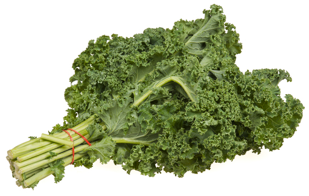

# Data Kale



## Configuration

### credential
#### s3-access-key
The access key to the s3 backend
#### s3-secret-key
The access secret to the s3 backend

### data
#### root

The location of the local directory that will contain all the repositories directories.
Ex. `data.root` is set to `/data` then the data for the repository `namespace-puddle` will end up in `/data/namespace-puddle`.

Note: Just as `pathlib.Path(.)`, the default is to be relative to home directory, i.e. `data` is `~/data`.
It supports expanduser so it's easier to just be explicit with `~/data`.

### Example

`~/.kale.toml`:
```toml
[credentials]
s3-access-key = "ACCESS"
s3-secret-key = "SECRET"

[data]
root = "~/data"
```

## Install
```bash
virtualenv venv
source venv/bin/activate
pip install -e .
```

## Run

### Download
```bash
python -m data_kale.download namespace-puddle
```

### Upload
```bash
python -m data_kale.upload namespace-puddle
```

## Test

### Install
```bash
source venv/bin/activate
python setup.py test
```

### Run
```bash
source venv/bin/activate
pytest
```
